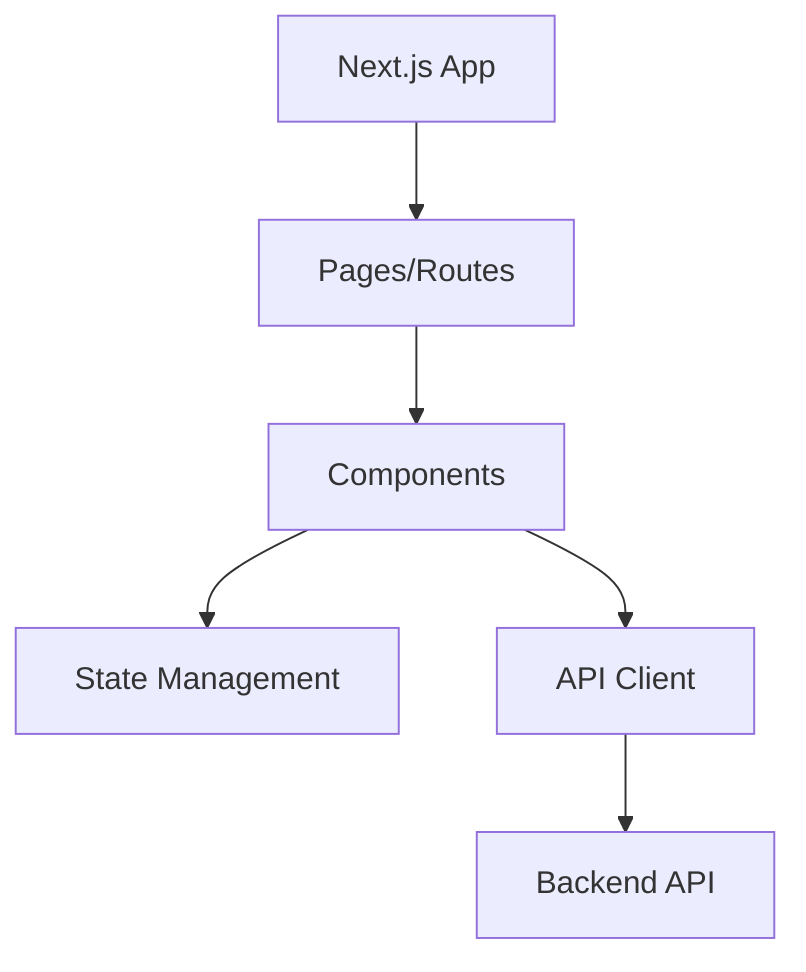

<div align="center">

# echo

> A TypeScript project built with Next.js

[](#) [](#) [](#)

</div>

---

## 📖 Overview

This project is built with TypeScript using Next.js.

---

## ✨ Features

- Built with Next.js

---

## 🏗️ Architecture



The Next.js application uses a component-based architecture with centralized state management.

---

## 📁 Project Structure

```
├── apps
│   ├── web
│   │   ├── app
│   │   │   ├── layout.d.ts
│   │   │   ├── layout.js
│   │   │   ├── layout.tsx
│   │   │   ├── page.d.ts
│   │   │   ├── page.js
│   │   │   └── page.tsx
│   │   ├── components
│   │   │   ├── theme-provider.d.ts
│   │   │   ├── theme-provider.js
│   │   │   └── theme-provider.tsx
│   │   ├── components.json
│   │   ├── eslint.config.js
│   │   ├── next-env.d.ts
│   │   ├── next.config.d.ts
│   │   ├── next.config.js
│   │   ├── next.config.ts
│   │   ├── package.json
│   │   ├── postcss.config.mjs
│   │   └── tsconfig.json
│   └── widget
│       ├── app
│       │   ├── layout.d.ts
│       │   ├── layout.js
│       │   ├── layout.tsx
│       │   ├── page.d.ts
│       │   ├── page.js
│       │   └── page.tsx
│       ├── components
│       │   ├── theme-provider.d.ts
│       │   ├── theme-provider.js
│       │   └── theme-provider.tsx
│       ├── components.json
│       ├── eslint.config.js
│       ├── next-env.d.ts
│       ├── next.config.d.ts
│       ├── next.config.js
│       ├── next.config.ts
│       ├── package.json
│       ├── postcss.config.mjs
│       └── tsconfig.json
├── packages
│   ├── eslint-config
│   │   ├── base.js
│   │   ├── next.js
│   │   ├── package.json
│   │   ├── react-internal.js
│   │   └── README.md
│   ├── math
│   │   ├── src
│   │   │   ├── add.d.ts
│   │   │   ├── add.js
│   │   │   ├── add.ts
│   │   │   └── multiple.ts
│   │   ├── package.json
│   │   ├── tsconfig.d.ts
│   │   ├── tsconfig.js
│   │   └── tsconfig.json
│   ├── typescript-config
│   │   ├── base.json
│   │   ├── nextjs.json
│   │   ├── package.json
│   │   ├── react-library.json
│   │   └── README.md
│   └── ui
│       ├── components.json
│       ├── eslint.config.js
│       ├── package.json
│       ├── postcss.config.mjs
│       ├── tsconfig.json
│       └── tsconfig.lint.json
├── AGENTS.md
├── package.json
├── pnpm-workspace.yaml
├── README.md
├── tsconfig.json
└── turbo.json
```

---

## 🚀 Getting Started

### Prerequisites

- Node.js >=20

### Installation

1. **Clone the repository**
   ```bash
   git clone <repository-url>
cd <project-name>
   ```

2. **Install dependencies**
   ```bash
   npm install
   ```

3. **Build the project**
   ```bash
   npm run build
   ```


---

## 💡 Usage

### Running the project

Start the application:

```bash
npm run dev
```


---

## 🤝 Contributing

Contributions are welcome! Here's how to get started:

1. Fork the repository
2. Create a feature branch (`git checkout -b feature/amazing-feature`)
3. Make your changes
4. Commit your changes (`git commit -m 'Add amazing feature'`)
5. Push to the branch (`git push origin feature/amazing-feature`)
6. Open a Pull Request

---

## 📄 License

See the [LICENSE](LICENSE) file for details.
