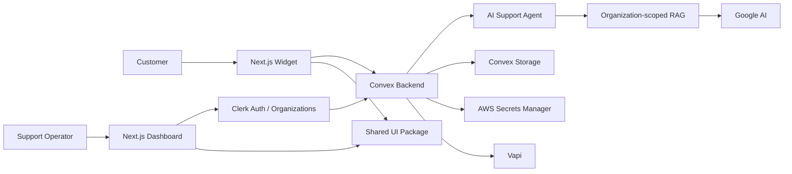

<div align="center">

# Echo

**Multi-tenant B2B SaaS for AI-powered customer support with chat, RAG, human escalation, and voice integrations.**

Built with Next.js, React, TypeScript, Convex, Clerk, Google AI, Vapi, AWS Secrets Manager, Turborepo, and pnpm.

</div>

---

## Overview

Echo is a work-in-progress B2B SaaS platform for organizations that want to provide AI-assisted customer support through an embeddable chat experience.

Each organization gets its own isolated workspace, conversations, widget settings, knowledge base, and integrations. The AI support agent can answer questions from organization-specific uploaded content, escalate conversations to a human operator, and mark completed conversations as resolved.

The project is organized as a monorepo so the dashboard, customer-facing widget, backend, and shared UI can evolve together while keeping clear boundaries.

## Core Features

- **Multi-tenant organizations** using Clerk
- **AI customer-support agent** powered by Google AI
- **RAG knowledge base** with organization-scoped namespaces
- **File ingestion** for text, PDF, and image content
- **Conversation lifecycle** with unresolved, escalated, and resolved states
- **Human handoff** from the AI assistant to an operator
- **Operator message enhancement** using AI
- **Embeddable customer-support widget**
- **Widget customization** including greeting messages and suggested questions
- **Vapi integration** for voice-assistant workflows
- **Per-organization integration secrets** stored in AWS Secrets Manager
- **Shared component library** built around shadcn/Radix primitives
- **Sentry integration** for application monitoring
- **Turborepo + pnpm workspaces** for monorepo development

## Architecture



## How the AI Support Flow Works

1. A customer starts a contact session through the widget.
2. Echo creates a conversation and an AI-agent thread.
3. Customer messages are processed by the support agent while the conversation is unresolved.
4. For product or service questions, the agent searches the organization's own RAG namespace.
5. Relevant knowledge-base content is used to generate a grounded response.
6. The agent can escalate the conversation to a human operator when needed.
7. A human operator can continue the conversation from the dashboard.
8. The conversation can be marked as resolved when the issue is complete.

## Multi-Tenant Design

Echo separates organization data by `organizationId`.

Examples:

- Widget settings are indexed by organization.
- Plugin configuration belongs to one organization.
- Uploaded knowledge is added to a dedicated RAG namespace.
- Conversations belong to one organization.
- Integration secrets use organization-specific secret names.

Example secret naming pattern:

```text
tenant/{organizationId}/{service}
```

This keeps tenant-specific integration configuration separate from normal application data.

## Tech Stack

| Area            | Technology                       |
| --------------- | -------------------------------- |
| Frontend        | Next.js 16, React 19, TypeScript |
| Styling / UI    | Tailwind CSS, shadcn, Radix UI   |
| Forms           | React Hook Form, Zod             |
| State           | Jotai                            |
| Backend         | Convex                           |
| Authentication  | Clerk                            |
| AI Agent        | Convex Agent                     |
| RAG             | Convex RAG                       |
| AI Provider     | Google AI                        |
| Voice           | Vapi                             |
| Secret Storage  | AWS Secrets Manager              |
| Monitoring      | Sentry                           |
| Monorepo        | Turborepo                        |
| Package Manager | pnpm                             |

## Repository Structure

```text
echo/
├── apps/
│   ├── web/                    # Authenticated SaaS dashboard
│   │   ├── app/
│   │   └── modules/
│   │       ├── auth/
│   │       ├── customization/
│   │       ├── dashboard/
│   │       ├── files/
│   │       └── plugins/
│   │
│   └── widget/                 # Customer-facing support widget
│       ├── app/
│       └── modules/
│           ├── dashboard/
│           ├── ui/
│           └── widget/
│
├── packages/
│   ├── backend/                # Convex backend and AI/RAG logic
│   │   └── convex/
│   │       ├── private/        # Authenticated organization operations
│   │       ├── public/         # Widget-facing operations
│   │       ├── system/         # Internal operations and AI tooling
│   │       ├── lib/
│   │       └── schema.ts
│   │
│   ├── ui/                     # Shared UI components
│   ├── math/                   # Shared utilities
│   ├── eslint-config/          # Shared ESLint configuration
│   └── typescript-config/      # Shared TypeScript configuration
│
├── pnpm-workspace.yaml
├── turbo.json
└── package.json
```

## Backend Domains

### Conversations

Conversations have three states:

```text
unresolved -> escalated -> resolved
```

While a conversation is unresolved, the AI assistant can answer customer messages. When a customer asks for a human agent, the conversation can be escalated so an operator can take over.

### Knowledge Base & RAG

Uploaded content is extracted and stored in an organization-specific RAG namespace.

Currently supported ingestion paths include:

- Plain text
- Other text-based content transformed to Markdown
- PDF documents
- Images, including document transcription or image description

Duplicate uploads are detected using a content hash.

### AI Tools

The support agent includes tools for:

- Searching the organization's knowledge base
- Escalating a conversation
- Resolving a conversation

The system prompt instructs the assistant to ground product and service answers in the organization's uploaded knowledge instead of inventing information.

### Vapi Integration

Organizations can connect Vapi credentials through the dashboard.

The backend retrieves Vapi configuration through organization-specific integration data and can load:

- Assistants
- Phone numbers

Voice-assistant settings can then be connected to the widget configuration.

### Secret Management

Integration credentials are not stored directly in the normal Convex application tables.

Echo stores the secret value in AWS Secrets Manager and keeps only the corresponding secret name in the plugin record.

## Getting Started

### Prerequisites

- Node.js 20+
- pnpm 10+
- Convex account/project
- Clerk application
- Google AI provider configuration
- AWS account with Secrets Manager access
- Vapi account if using voice functionality

### Install

```bash
git clone https://github.com/ali-salhab/echo.git
cd echo
pnpm install
```

### Environment Configuration

The repository currently references the following environment configuration directly:

```env
NEXT_PUBLIC_CONVEX_URL=
CLERK_JWT_ISSUER_DOMAIN=

AWS_ACCESS_KEY_ID=
AWS_SECRET_ACCESS_KEY=
AWS_REGION=
```

The backend also requires the credentials/configuration needed by the Google AI provider used by the AI SDK.

Clerk, Convex, Google AI, AWS, Vapi, and Sentry should be configured for the environment in which the project is running.

> Never commit private credentials or secret values to the repository.

### Run Development

```bash
pnpm dev
```

The workspace uses Turborepo to start the applications and packages that expose development tasks.

Current application ports:

```text
apps/web     -> http://localhost:3000
apps/widget  -> http://localhost:3001
```

### Build

```bash
pnpm build
```

### Type Check

```bash
pnpm typecheck
```

### Lint

```bash
pnpm lint
```

### Format

```bash
pnpm format
```

## Current Development Status

Echo is actively being developed.

Implemented areas visible in the current codebase include:

- Authentication and organization selection
- Dashboard structure
- Conversation management
- Widget UI
- Organization-specific widget settings
- File upload and AI-assisted text extraction
- RAG knowledge-base ingestion and search
- AI support-agent workflows
- Human escalation and resolution
- Vapi plugin integration
- AWS-backed integration-secret storage
- Sentry monitoring

Some product areas are still under development and should not yet be considered production-complete.

## Engineering Goals

The project is being developed around several architectural goals:

- Keep tenant data isolated by organization
- Keep application secrets outside normal application records
- Ground AI answers in organization-specific knowledge
- Share UI and configuration across applications
- Separate public widget operations from authenticated dashboard operations
- Keep frontend and backend strongly typed
- Make integrations extensible beyond the first provider

## Roadmap

Planned improvements include:

- Stronger tenant authorization checks across all public widget operations
- Rate limiting and abuse protection
- Subscription and plan enforcement
- Improved Vapi tenant configuration
- Automated tests
- CI/CD checks
- Production-ready environment documentation
- Better observability and privacy configuration
- Additional integrations
- Expanded widget customization

## Author

**Ali Salhab**

Full-stack JavaScript / TypeScript developer focused on modern SaaS, AI integrations, real-time applications, and scalable web architecture.

GitHub: [ali-salhab](https://github.com/ali-salhab)

---

If you are reviewing this project as part of a software-engineering application, the most relevant areas are the monorepo architecture, multi-tenant Convex backend, AI/RAG workflow, customer-support conversation lifecycle, and third-party integration design.
