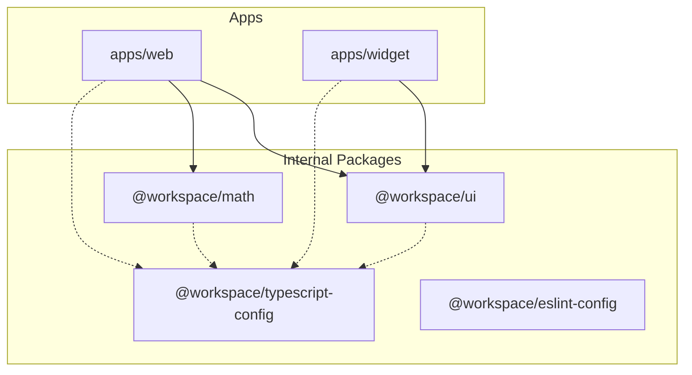

<div align="center">

# Echo Monorepo

> High-performance Next.js workspace managed with Turborepo and pnpm.

[](#)
[](#)
[](#)
[](#)

</div>

---

## 📖 Overview

**Echo** is a full-stack Monorepo containing multiple Next.js applications and shared internal packages, organized using `pnpm` workspaces and powered by `Turborepo` for optimized caching and task execution.

### Applications & Packages

- **`apps/web`**: Main Next.js web application.
- **`apps/widget`**: Secondary Next.js application / widget dashboard.
- **`packages/ui`**: Shared UI component library.
- **`packages/math`**: Shared mathematical utilities library.
- **`packages/typescript-config`**: Centralized TypeScript configurations.
- **`packages/eslint-config`**: Centralized ESLint configurations.

---

## 🏗️ Architecture



---

## 📁 Project Structure

```text
.
├── apps/
│   ├── web/          # Main Next.js App Router application
│   └── widget/       # Widget Next.js application
├── packages/
│   ├── eslint-config/      # Shared ESLint configs
│   ├── math/               # Shared math utilities
│   ├── typescript-config/  # Shared tsconfig bases
│   └── ui/                 # Shared UI components
├── pnpm-workspace.yaml
├── turbo.json
└── package.json
```

---

## 🚀 Getting Started

### Prerequisites

- **Node.js**: `>=20.0.0`
- **pnpm**: `>=9.0.0`

### Installation

1. **Clone the repository**

   ```bash
   git clone <repository-url>
   cd echo
   ```

2. **Install workspace dependencies**
   ```bash
   pnpm install
   ```

---

## 💡 Usage

### Running Development Server

To start all applications simultaneously with Turborepo caching:

```bash
pnpm dev
```

### Building for Production

To build all apps and packages:

```bash
pnpm build
```

### Type Checking & Linting

```bash
pnpm typecheck
pnpm lint
```
